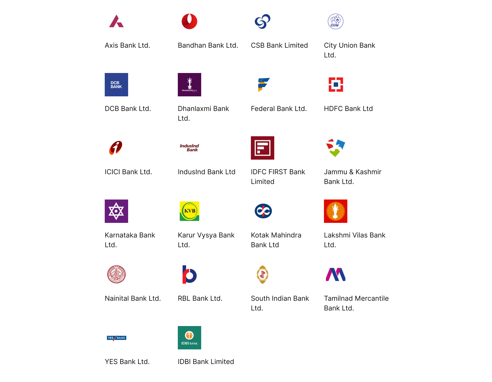
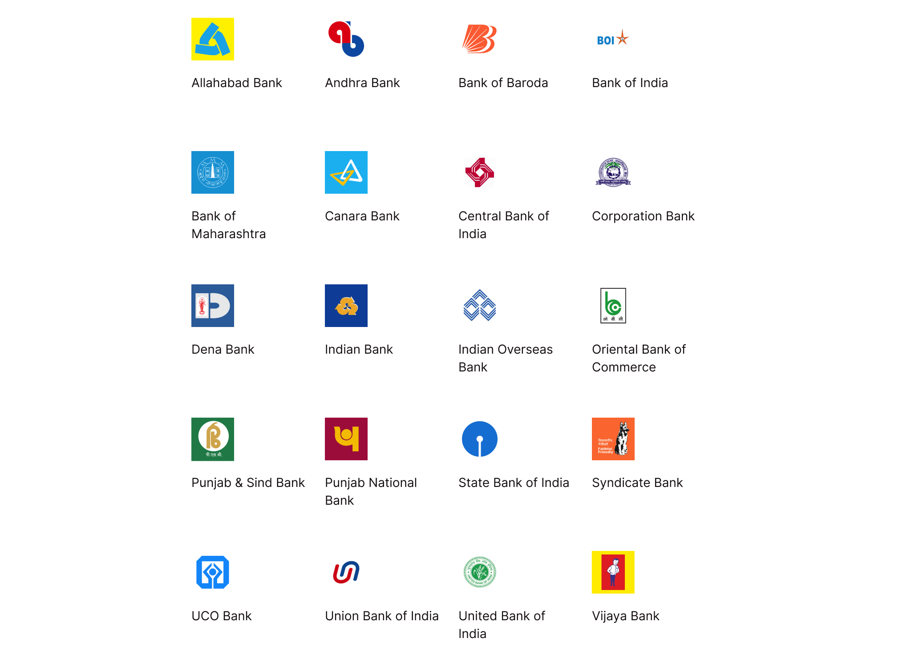
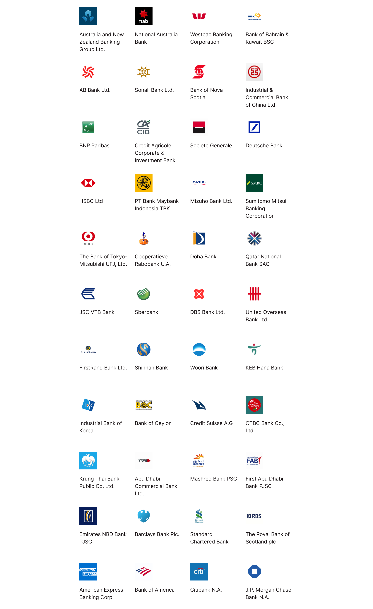
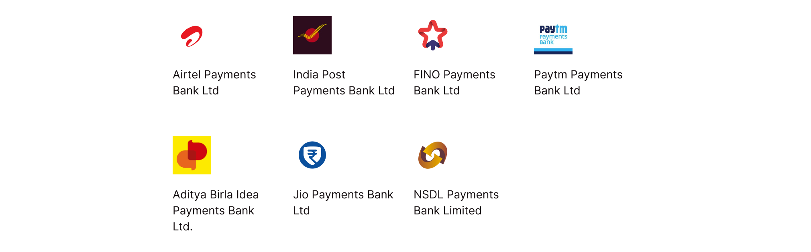

## Banking Structure

```

                     ┌─────────────────────────┐
                     │   Ministry of Finance   │
                     └────────────┬────────────┘
                                  │
                        ┌─────────▼─────────┐
                        │        RBI        │
                        └─────────┬─────────┘
                                  │
                      ┌───────────┴───────────┐
                      │                       │
            ┌─────────▼─────────┐   ┌─────────▼─────────┐
            │  Scheduled Banks  │   │ Unscheduled Banks │
            └─────────┬─────────┘   └───────────────────┘
                      │
          ┌───────────┴───────────┐
          │                       │
┌─────────▼─────────┐   ┌─────────▼─────────┐
│ Commercial Banks  │   │Co-operative Banks ├─┬─▶Urban Co-operative
└───────────────────┘   └───────────────────┘ └─▶State Co-operative
          │
          │ ┌───────────────────────────┐
          ├─▶ Private Sector Banks (22) │
          │ └───────────────────────────┘
          │ ┌───────────────────────────┐
          ├─▶ Public Sector Banks (20)  ├──────┬─▶SBI and Associate
          │ └───────────────────────────┘      ├─▶Other Nationalized
          │ ┌───────────────────────────┐      └─▶Other Public Sector
          ├─▶    Foreign Banks (44)     │
          │ └───────────────────────────┘
          │ ┌───────────────────────────┐
          └─▶ Regional Rural Banks (45) │
            └───────────────────────────┘

```


## Private Sector Banks (22)




## Public Sector Banks (20)




## Foreign Banks (44)




## Payments Banks (7)




## Help
* [Download All]()
* [RBI Listing](https://www.rbi.org.in/scripts/banklinks.aspx)


## Brought to you by
* **Abhimanyu Rana** - [planetabhi](http://planetabhi.com)


## License
This project is licensed under the GNU License - see the [LICENSE.md](Banks%20In%20India/LICENSE) file for details.
